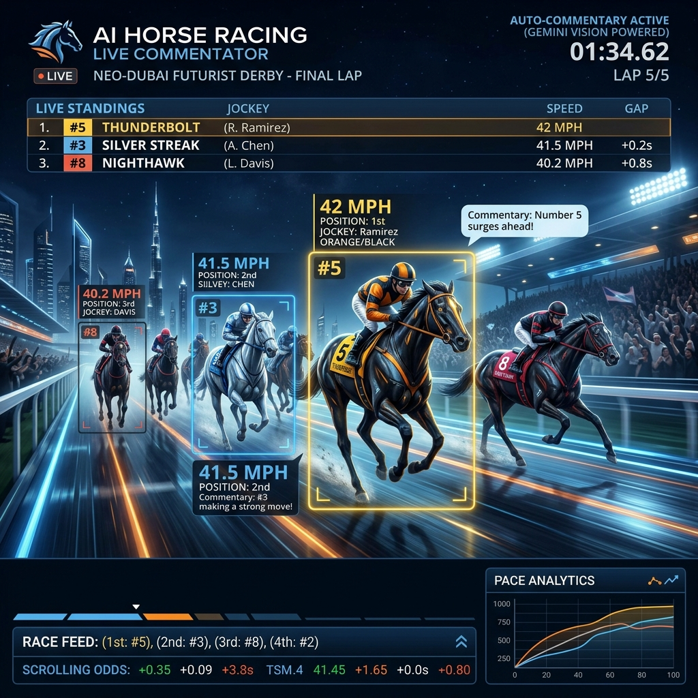

# AI Horse Racing Live Commentator

[]()
[]()
[]()
[]()

Generate vivid, real-time, and thrilling live commentary for horse racing videos using Google Gemini 2.5 Flash. Built for sports broadcasters, content creators, and developers who need automated, contextual, and hyper-realistic audio/text descriptions of fast-paced sporting events. Process unlimited video chunks with continuous memory of the race state.



## Key Features
*   **Generate thrilling real-time commentary** by analyzing video chunks frame-by-frame with Gemini Vision.
*   **Maintain continuous race context** using a built-in JSON memory manager to remember horse positions from previous segments.
*   **Prevent duplicate processing** with intelligent chunk caching, saving API costs and time.
*   **Process videos locally in batches** directly from directories for seamless pipeline integration.
*   **Output structured, timestamped narrative** ready for text-to-speech (TTS) conversion or subtitles.

## Quick Start
Get the AI commentator generating race transcripts in under 5 minutes.

1. **Install dependencies**
   ```bash
   git clone https://github.com/your-org/horce_racing.git
   cd horce_racing
   pip install google-genai python-dotenv
   ```
2. **Configure API Key**
   ```bash
   echo "GOOGLE_GENAI_API_KEY=your_gemini_api_key_here" > .env
   ```
3. **Run the Commentator**
   Place your chunked MP4 files in a directory and run:
   ```bash
   python model.py
   ```
   **Expected Output:**
   ```
   Processing: race_chunk_00_10.mp4
   [00:01] Number 3 bursts out of the gate! The jockey in red is urging the horse forward...
   [00:10] Number 7 is gaining ground on the outside...
   ```
   *The system uploads the video to Gemini, injects previous race context, and streams back the live commentary.*

## Installation

### Method 1: Local Pip Install (Recommended)
```bash
git clone https://github.com/your-org/horce_racing.git
cd horce_racing
pip install -r requirements.txt # (or pip install google-genai python-dotenv)
```

### Method 2: Virtual Environment
```bash
python3 -m venv venv
source venv/bin/activate
pip install google-genai python-dotenv
```

## Usage Examples

### Example 1: Basic Video Segment Commentary
**Problem:** You have a single 10-second clip of a horse overtaking another.
```python
from model import GeminiVLCommentator
import os

commentator = GeminiVLCommentator(api_key=os.getenv("GOOGLE_GENAI_API_KEY"))
commentary = commentator.generate_commentary(
    video_path="./input_video/race_chunk_10_20.mp4",
    prompt="Describe the overtake happening at 00:15 in an energetic tone."
)
print(commentary)
```
**Output:** `"[00:15] Incredible! Number 5 finds a gap and surges past the leader with breathtaking speed!"`
*The agent analyzes the clip and returns a highly specific, thrilling description.*

### Example 2: Continuous Race Processing
**Problem:** You need to commentate a full 2-minute race divided into 10-second chunks without losing context of who is in the lead.
```python
# The built-in MemoryManager handles this automatically
# Just run the script pointing to the folder of chunks
# python model.py
```
**Output:** The script will output consecutive commentary. Chunk 2's prompt will automatically include the context: "Previously, Number 3 was leading..."
*Memory injection ensures the AI knows the race history, preventing contradictory commentary.*

### Example 3: Customizing the Commentator Persona
**Problem:** You want the commentary to sound analytical and calm instead of energetic.
```python
custom_prompt = """You are a calm, analytical horse racing expert. 
Focus strictly on the jockey's posture, stride length, and tactical positioning. 
Format as [MM:SS] Analysis."""

commentator.generate_commentary(video_path, custom_prompt)
```
**Output:** `"[00:10] Notice the jockey on Number 4 maintaining a low aerodynamic profile, preserving stamina..."`
*Easily swap the prompt to change the style and output format of the Gemini model.*

## Troubleshooting
*   **`google.api_core.exceptions.InvalidArgument`**: Your video file might be too large or the API key is missing/invalid. Ensure `.env` is loaded properly.
*   **Commentary repeating itself**: Check the `memory/` directory. If the JSON state is corrupted, delete it to reset the race memory.
*   **Rate Limits**: The script includes a `time.sleep(30)` to allow Google's servers to process the video. If you hit API limits, increase this sleep duration.

## 📚 Documentation Links

Ready to dive deeper? Explore our comprehensive documentation to understand how the AI commentator tracks races and generates thrilling real-time narratives.

*   **[System Architecture](./docs/ARCHITECTURE.md)**
    Uncover the mechanics behind our continuous race context tracking. Dive into the data flow diagrams that explain how the built-in JSON memory manager and intelligent chunk caching work together to prevent duplicate processing and reduce API costs.
*   **[API Reference](./docs/API_REFERENCE.md)**
    Leverage the full power of the Gemini Vision integration within your own codebase. Access detailed class documentation for `GeminiVLCommentator`, including specific prompt injection methods and payload structures for retrieving structured, timestamped narratives.
*   **[Configuration Guide](./docs/CONFIGURATION.md)**
    Customize the commentator to fit your exact broadcasting needs. Learn how to meticulously adjust system prompts to change the AI's persona, handle rate limits with configurable sleep durations, and optimize local batch processing directories.

## Contributing
Contributions are welcome! If you want to add support for multiple languages, TTS integration, or better video chunking, please submit a Pull Request.

## License
This project is open-sourced under the MIT License.